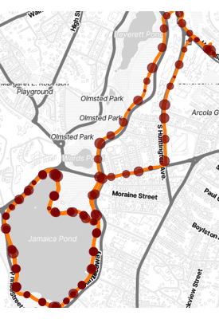

# test_stopr
Example of using stopr package

After modifying "import_test_tack_gpx.R" for the filename of the GPX file, you can create the map with these R commands:

```
source("import_test_tack_gpx.R")
source("test_find_stops.R")
p
```


