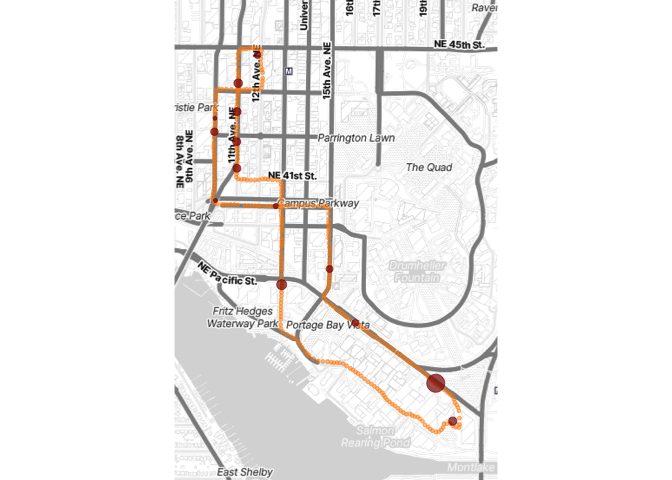

## Setup


```r
# Load packages, installing as needed
if (!requireNamespace("pacman", quietly = TRUE)) install.packages("pacman")
pacman::p_load(here, tibble, plotKML, dplyr, lubridate, readr, scales, knitr)
pacman::p_load_gh("brianhigh/stopr")
pacman::p_load_gh("stadiamaps/ggmap")

# Run a separate script to register the API key to use with Stadia Maps
# See: https://docs.stadiamaps.com/guides/migrating-from-stamen-map-tiles/
# register_stadiamaps("YOUR-API-KEY-HERE")
source(here("reg_api.R"))

# Define variables
gpx_file <- system.file("extdata", "test_data.gpx", package = "stopr")
stop_threshold_secs = 20
```

## Load data


```r
# Import GPX file
df <- as_tibble(readGPX(gpx_file)$tracks[[1]][[1]]) %>% 
  select(longitude = lon, latitude = lat, datetime = time) %>% 
  mutate(datetime = as_datetime(datetime))
```

## Find stops

Given a GPS track (coordinates and timestamps), find the stops on the route.


```r
# Find the stops on the route
stops <- find_stops(df, stop_min_duration_s = stop_threshold_secs)
```

## Show a list of stops


```r
kable(stops)
```


|start               |end                 | latitude| longitude| duration|
|:-------------------|:-------------------|--------:|---------:|--------:|
|2019-10-31 23:08:47 |2019-10-31 23:09:27 | 47.65846| -122.3178|       40|
|2019-10-31 23:09:46 |2019-10-31 23:10:06 | 47.65617| -122.3178|       20|
|2019-10-31 23:10:22 |2019-10-31 23:10:44 | 47.65598| -122.3148|       22|
|2019-10-31 23:11:54 |2019-10-31 23:12:28 | 47.65388| -122.3121|       34|
|2019-10-31 23:13:05 |2019-10-31 23:13:39 | 47.65209| -122.3109|       34|
|2019-10-31 23:14:10 |2019-10-31 23:21:43 | 47.65008| -122.3069|      453|
|2019-10-31 23:22:00 |2019-10-31 23:22:49 | 47.64881| -122.3060|       49|
|2019-10-31 23:25:40 |2019-10-31 23:26:59 | 47.65336| -122.3145|       79|
|2019-10-31 23:29:08 |2019-10-31 23:29:52 | 47.65724| -122.3167|       44|
|2019-10-31 23:29:55 |2019-10-31 23:30:41 | 47.65813| -122.3167|       46|
|2019-10-31 23:30:48 |2019-10-31 23:31:35 | 47.65913| -122.3167|       47|
|2019-10-31 23:31:37 |2019-10-31 23:32:31 | 47.66008| -122.3166|       54|
|2019-10-31 23:32:48 |2019-10-31 23:33:20 | 47.66101| -122.3157|       32|
|2019-10-31 23:35:01 |2019-10-31 23:35:21 | 47.65891| -122.3178|       20|

## Create bounding box for map


```r
# Prepare a data frame to use for making the bounding box of the basemap
center_lat <- mean(range(df$latitude))
center_lon <- mean(range(df$longitude))
border <- 0.005
bbox.df <- data.frame(
  lat = c(center_lat - border, center_lat, center_lat + border),
  lon = c(center_lon - border, center_lon, center_lon + border))
```

## Create base map


```r
# Create the basemap
bbox <- make_bbox(lon, lat, bbox.df, f = .3)
basemap <- get_stadiamap(bbox, zoom = 15, maptype = "stamen_toner_lite")
```

```
## ℹ © Stadia Maps © Stamen Design © OpenMapTiles © OpenStreetMap contributors.
```

## Create map


```r
# Create the plot
p <- ggmap(basemap) +
  geom_point(mapping = aes(x = longitude, y = latitude),
             data = df, color = 'green', size = 1, alpha = 0.5) +
  geom_point(mapping = aes(x = longitude, y = latitude,
                           size = log10(rescale(duration) + 1)/2),
             data = stops, color = 'magenta', alpha = 0.9) +
  theme_void() + theme(legend.position = "none") +
  labs(x = NULL, y = NULL, fill = NULL)
```

## Show map

<!-- -->
